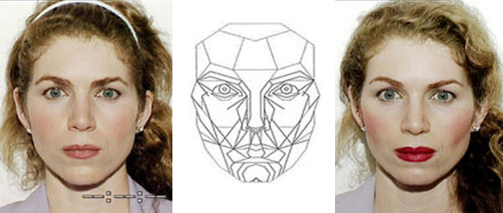

  

Across thousands of years of history, the human kind has been fascinated with facial beauty. Living in the digital world now, virtual makeup tools are becoming more popular than ever. The need for improving existing virtual makeup application has been increasingly receiving attention in the research community recently. Given an image with a face as a source and another image with a face as the makeup reference, the problem is transferring makeup style from the reference to the source. GAN-based frameworks like [BeautyGAN](liusi-group.com/pdf/BeautyGAN-camera-ready_2.pdf) are considered as leading studies tackling this problem. That said, it can be seen that all previous methods are lacking motivation from real makeup instruction, which can be thought of as kind of supervised learning, a guide. We believe that without further investigations to adapt to the real makeup process, any proposed framework will still struggle to create a human-level beauty makeup transfer.

We further extend the existing framework in BeautyGAN. We apply the so-called Beauty Mask as a novel mask for makeup tasks, which is driven by the real facial beauty model and makeup process.

- [Slides](https://docs.google.com/presentation/d/1kGspFe0zeXK6mwabWXZ-KqPbDzsmQC8cg0DbT4kcWe4/edit?usp=sharing)
- [Result Video - Coming Soon]
- [Code for Webdemo](https://github.com/thaoshibe/Facial-Makeup-Web)
- [Code for GUI demo](https://github.com/thaoshibe/GUI-Makeup-Transfer)

